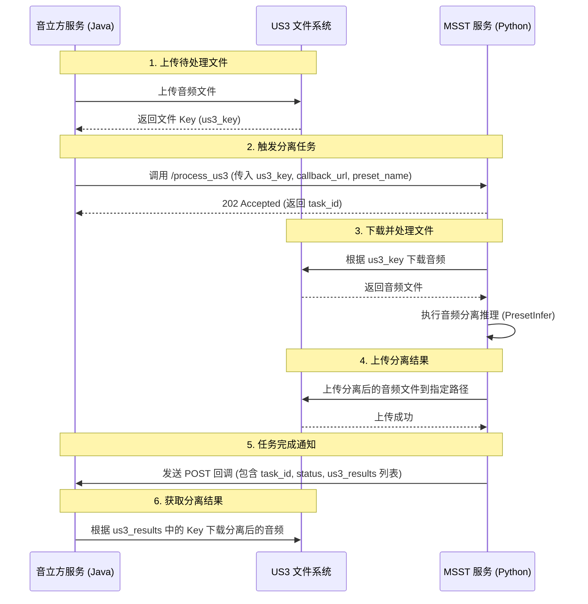

# MSST Service Interaction Diagram

```mermaid
sequenceDiagram
    participant Java as 音立方服务 (Java)
    participant US3 as US3 文件系统
    participant MSST as MSST 服务 (Python)

    Note over Java, US3: 1. 上传待处理文件
    Java->>US3: 上传音频文件
    US3-->>Java: 返回文件 Key (us3_key)

    Note over Java, MSST: 2. 触发分离任务
    Java->>MSST: 调用 /process_us3 (传入 us3_key, callback_url, preset_name)
    MSST-->>Java: 202 Accepted (返回 task_id)

    Note over MSST, US3: 3. 下载并处理文件
    MSST->>US3: 根据 us3_key 下载音频
    US3-->>MSST: 返回音频文件
    MSST->>MSST: 执行音频分离推理 (PresetInfer)

    Note over MSST, US3: 4. 上传分离结果
    MSST->>US3: 上传分离后的音频文件到指定路径
    US3-->>MSST: 上传成功

    Note over MSST, Java: 5. 任务完成通知
    MSST->>Java: 发送 POST 回调 (包含 task_id, status, us3_results 列表)

    Note over Java, US3: 6. 获取分离结果
    Java->>US3: 根据 us3_results 中的 Key 下载分离后的音频
```
