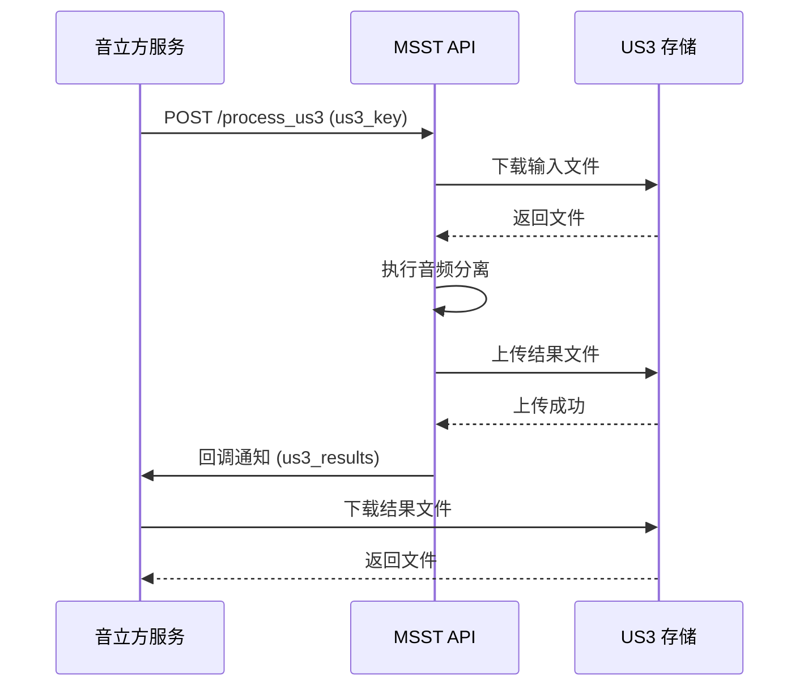
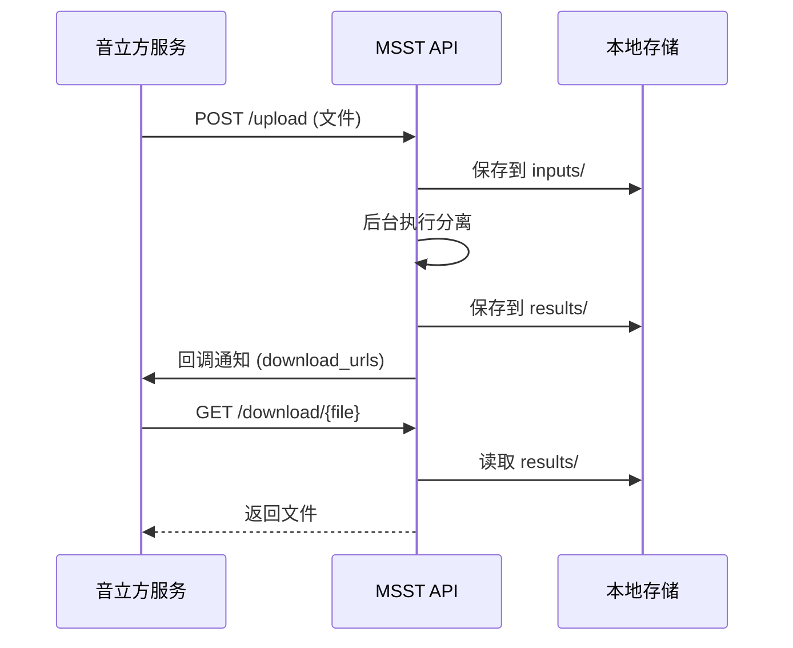

# MSST-WebUI 项目周报

**周期**: 2026年1月20日 - 2026年1月26日  
**负责人**: 开发团队

---

## 一、本周工作总结

### 1.1 项目调研与分析

#### 1.1.1 项目背景了解
- **项目名称**: MSST-WebUI (Music-Source-Separation-Training WebUI)
- **项目定位**: 音乐源分离训练和推理的 Web 界面工具
- **核心功能**: 
  - 支持 MSST 模型和 VR 模型的推理
  - 自定义处理流程(Preset)
  - 模型安装和管理
  - 集成多种工具(SOME、高级集成模式等)

#### 1.1.2 技术栈梳理
- **后端框架**: FastAPI
- **深度学习**: PyTorch
- **音频处理**: librosa, soundfile, pedalboard
- **前端界面**: Gradio
- **部署方式**: 
  - 本地部署
  - Google Colab 在线运行
  - UCloud 一键部署

### 1.2 本地环境搭建尝试

#### 1.2.1 环境准备
- ✅ Python 3.10 虚拟环境创建
- ✅ PyTorch 2.2.2 安装(CPU 模式)
- ✅ NumPy 版本兼容性问题解决(降级到 1.26.4)

#### 1.2.2 依赖安装问题
- ❌ llvmlite 编译失败
  - 问题: macOS x86_64 架构下缺少 LLVM 开发库
  - 尝试方案:
    - 安装 cmake
    - 安装 LLVM (编译时间过长,中途终止)
    - 使用预编译版本(平台不匹配)
- ❌ 最终决定放弃本地安装,转向在线环境

### 1.3 在线环境探索

#### 1.3.1 Google Colab 方案
- **优势**: 免费、有 GPU 支持、开箱即用
- **原理**: 在 Google 云端虚拟机运行,代码从 GitHub 仓库下载
- **数据流**: 
  - 用户上传音频文件到 Colab
  - 在云端执行分离
  - 下载结果到本地

### 1.4 API 服务方案设计

#### 1.4.1 需求分析
**原始需求**: 
- 音立方服务通过文件链接通知 MSST 服务
- MSST 从云存储下载文件
- 执行音频分离
- 上传结果到云存储
- 回调通知音立方

#### 1.4.2 方案对比

##### 方案 1: 通过 US3 云存储(原方案)
**链路图**:

**实现要点**:
- 依赖 ufile SDK
- 需要 US3 凭证配置
- 4 次网络传输(下载→处理→上传→下载)

##### 方案 2: 直接文件上传/下载(新方案)
**链路图**:

**实现要点**:
- 无需额外依赖
- 2 次网络传输(上传→下载)
- 需要本地文件管理

#### 1.4.3 方案对比表

| 对比项 | 方案 1: US3 云存储 | 方案 2: 直接文件传输 |
|--------|-------------------|---------------------|
| **网络传输** | 4 次 | 2 次 |
| **存储需求** | 需要 US3 存储 | 仅本地存储 |
| **实现复杂度** | 中等 | 简单 |
| **依赖** | 需要 ufile SDK | 无额外依赖 |
| **文件管理** | 云存储管理 | 需本地清理 |
| **扩展性** | 高(多实例共享) | 低(需共享存储) |
| **成本** | US3 存储费用 | 无存储费用 |
| **可靠性** | 高(云存储持久化) | 中(本地存储可能丢失) |
| **网络延迟** | 较高 | 较低 |
| **并发处理** | 好 | 需处理文件冲突 |

**推荐**: 方案 2 (直接文件传输)

### 1.5 API 服务实现

#### 1.5.1 创建 api_service_v2.py
- ✅ 实现文件上传接口 `POST /upload`
- ✅ 实现任务状态查询 `GET /status/{task_id}`
- ✅ 实现结果文件下载 `GET /download/{task_id}/{filename}`
- ✅ 实现结果列表查询 `GET /results/{task_id}`
- ✅ 实现任务清理 `DELETE /task/{task_id}`
- ✅ 实现健康检查 `GET /health`
- ✅ 支持后台异步处理
- ✅ 支持回调通知

#### 1.5.2 核心功能特性
- **任务管理**: 使用 task_id 追踪任务状态
- **后台处理**: 使用 FastAPI BackgroundTasks 异步执行
- **状态存储**: 内存存储(生产环境建议使用 Redis)
- **文件管理**: 
  - 输入文件保存到 `inputs/{task_id}/`
  - 输出文件保存到 `results/{task_id}/extra_output/`
  - 支持手动清理任务文件

---

## 二、技术难点与解决方案

### 2.1 依赖安装问题
**问题**: llvmlite 在 macOS x86_64 上编译失败
**原因**: 缺少 LLVM 开发库,且预编译版本不匹配
**解决方案**: 
- 放弃本地安装
- 使用 Google Colab 在线环境

### 2.2 网络连接问题
**问题**: 无法连接 GitHub 推送代码
**原因**: 网络限制或需要代理
**解决方案**: 
- 配置 Git 代理
- 或等待网络恢复后推送
- 或使用浏览器上传

### 2.3 方案选择
**问题**: 云存储 vs 本地存储
**考虑因素**: 
- 网络传输次数
- 实现复杂度
- 扩展性
- 成本
**解决方案**: 选择方案 2(直接文件传输)

---

## 三、下周工作计划

### 3.1 代码管理
- [ ] 拉取 Gitee 仓库
- [ ] 创建开发分支

### 3.2 测试与验证
- [ ] 在 Google Colab 上测试 api_service_v2.py
- [ ] 测试文件上传功能
- [ ] 测试音频分离功能
- [ ] 测试结果下载功能
- [ ] 测试回调通知功能

### 3.3 功能完善
- [ ] 添加任务超时处理
- [ ] 添加文件大小限制
- [ ] 添加文件格式验证
- [ ] 添加错误处理和日志记录
- [ ] 添加 API 文档(Swagger)
- 
---

## 四、总结

### 4.1 本周成果
- ✅ 完成项目调研和技术栈梳理
- ✅ 完成本地环境搭建尝试
- ✅ 完成 API 服务方案设计
- ✅ 实现 api_service_v2.py 核心功能

### 4.2 下周目标
- 完成代码推送和版本管理
- 完成功能测试和验证
- 完善文档和部署准备
- 优化性能和监控
---

**报告日期**: 2026年1月26日  
**下次报告日期**: 2026年2月2日